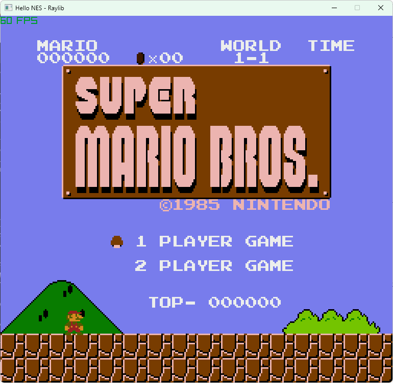

# Sample.Dotnet.Nes

Sample NES(Nintendo Entertainment System) Emulator

based on https://leanpub.com/nes-emulator-en, with the implementation adapted for .NET.

- CPU
- PPU
- APU
  - no DMC
- Mapper
  - only NROM(mapper 0)

